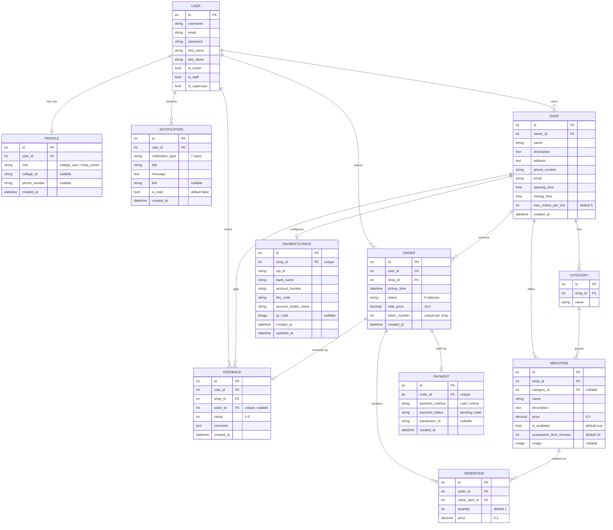
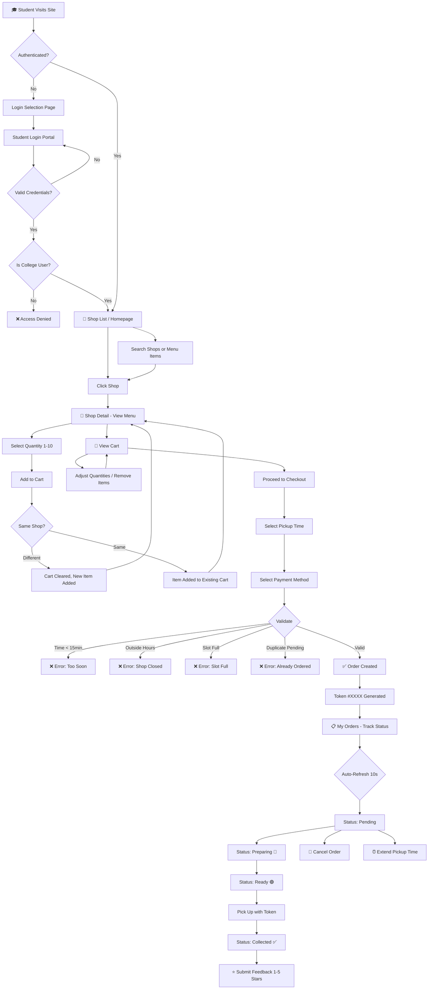
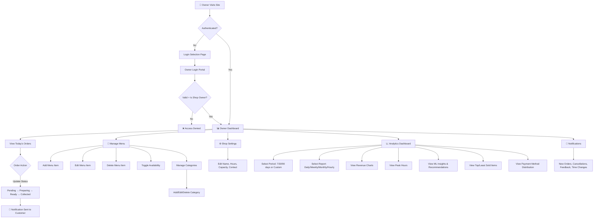
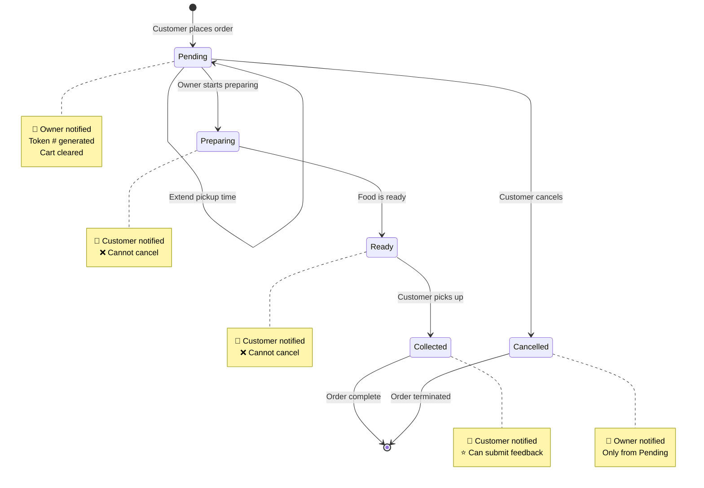
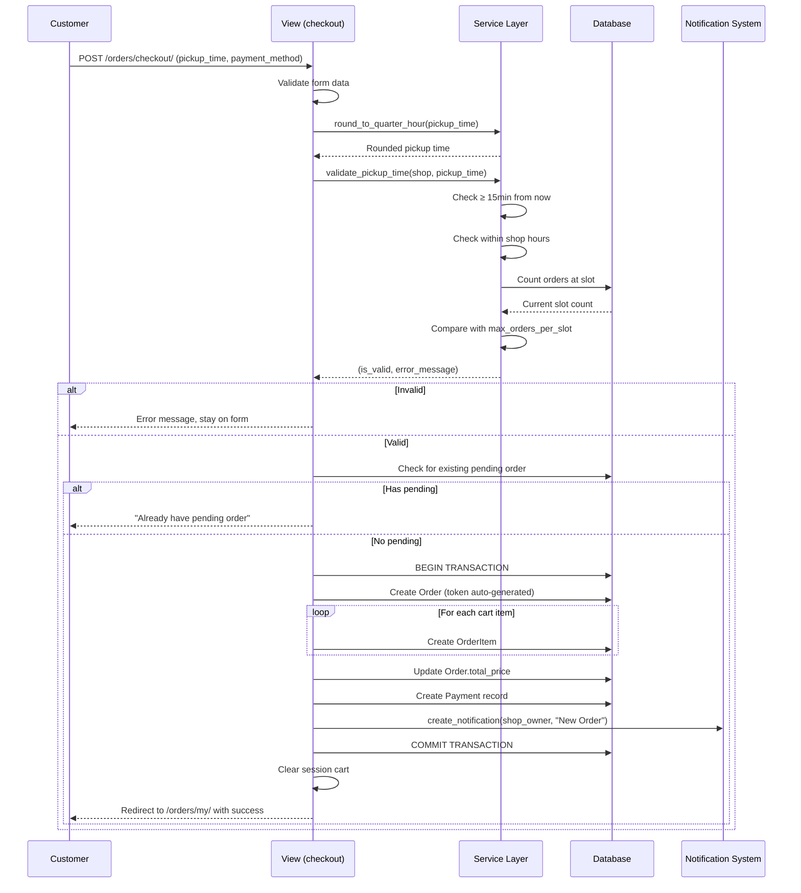
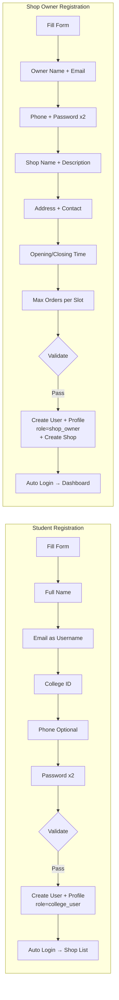

# 🛒 FoodR — Complete Developer Guide

> **A comprehensive, end-to-end technical reference for the FoodR College Food Ordering Platform.**
> This guide covers architecture, data models, workflows, API routes, business logic, security, and everything a new developer needs to understand, extend, or maintain this project.

---

## 📑 Table of Contents

1. [Project Overview](#1-project-overview)
2. [Tech Stack & Dependencies](#2-tech-stack--dependencies)
3. [Project Architecture](#3-project-architecture)
4. [Directory Structure](#4-directory-structure)
5. [Application Modules (Django Apps)](#5-application-modules-django-apps)
6. [Entity-Relationship Diagram](#6-entity-relationship-diagram)
7. [Database Models — Full Reference](#7-database-models--full-reference)
8. [URL Routing Map](#8-url-routing-map)
9. [Authentication & Authorization](#9-authentication--authorization)
10. [User Workflows & Flow Diagrams](#10-user-workflows--flow-diagrams)
11. [Core Business Logic](#11-core-business-logic)
12. [Notification System](#12-notification-system)
13. [Analytics Engine](#13-analytics-engine)
14. [Payment System](#14-payment-system)
15. [Frontend & Template System](#15-frontend--template-system)
16. [Theme & Dark Mode System](#16-theme--dark-mode-system)
17. [Session-Based Cart System](#17-session-based-cart-system)
18. [Admin Panel Configuration](#18-admin-panel-configuration)
19. [Security Implementation](#19-security-implementation)
20. [Configuration & Environment](#20-configuration--environment)
21. [Getting Started — Local Development](#21-getting-started--local-development)
22. [Deployment Guide](#22-deployment-guide)
23. [Testing Guide](#23-testing-guide)
24. [Extending the Project](#24-extending-the-project)
25. [Troubleshooting & FAQ](#25-troubleshooting--faq)
26. [Glossary](#26-glossary)

---

## 1. Project Overview

### What is FoodR?

**FoodR** is a full-stack Django web application designed for **college campus food ordering**. It connects **college students** (customers) with **on-campus food shops** (vendors), enabling a seamless digital ordering experience.

### Why was it built?

| Problem | Solution |
|---------|----------|
| Long queues at college food shops | Digital ordering with scheduled pickup times |
| No visibility into order status | Real-time status tracking with auto-refresh |
| Difficulty managing menu items | Full CRUD menu management for shop owners |
| No feedback mechanism | Star rating + comment system after order completion |
| No business insights for shop owners | Analytics dashboard with revenue charts, peak hours, and ML-powered recommendations |
| Cash-only limitations | Support for both cash and online (UPI/Bank) payments |

### How does it work?

```
┌─────────────────────────────────────────────────────────────────┐
│                        FoodR Platform                           │
│                                                                 │
│  ┌──────────────┐                        ┌──────────────────┐   │
│  │   STUDENTS   │                        │   SHOP OWNERS    │   │
│  │              │                        │                  │   │
│  │ • Browse     │    ┌──────────────┐    │ • Dashboard      │   │
│  │ • Search     │───▶│   Django     │◀───│ • Menu CRUD      │   │
│  │ • Order      │    │   Server    │    │ • Order Mgmt     │   │
│  │ • Pay        │◀───│   (MVT)     │───▶│ • Analytics      │   │
│  │ • Track      │    └──────┬───────┘    │ • Settings       │   │
│  │ • Feedback   │           │            │ • Notifications  │   │
│  └──────────────┘           │            └──────────────────┘   │
│                      ┌──────┴───────┐                           │
│                      │   SQLite     │                           │
│                      │   Database   │                           │
│                      └──────────────┘                           │
└─────────────────────────────────────────────────────────────────┘
```

### Key Features

| Feature | Description |
|---------|-------------|
| **Role-Based Access** | Two distinct user roles: College User and Shop Owner with separate login portals |
| **Shop Management** | Full CRUD for shops, menu items, and categories |
| **Session Cart** | Add items, adjust quantities (1-10), auto-clear on shop switch |
| **Smart Checkout** | 15-minute slot-based pickup scheduling with capacity limits |
| **Order Lifecycle** | Pending → Preparing → Ready → Collected (or Cancelled) |
| **Token System** | Unique 4-digit token per order for pickup verification |
| **Real-Time Notifications** | In-app notification system for order updates, feedback, cancellations |
| **Analytics Dashboard** | Revenue tracking, peak hours, Chart.js visualizations, heuristic ML insights |
| **Feedback System** | 1-5 star ratings with comments, tied to specific orders |
| **Dual Payment** | Cash and Online (UPI ID, bank transfer, QR code) |
| **Dark Mode** | CSS variable-based theme system with localStorage persistence |
| **Auto-Refresh** | Order list (10s) and owner dashboard (15s) polling |

---

## 2. Tech Stack & Dependencies

### Core Framework

| Component | Technology | Version |
|-----------|-----------|---------|
| **Backend** | Django | 5.0+ |
| **Language** | Python | 3.10+ |
| **Database** | SQLite | 3 |
| **Template Engine** | Django Template Language (DTL) | Built-in |
| **WSGI Server** | Gunicorn (production) / Django Dev Server | — |

### Python Dependencies

| Package | Version | Purpose |
|---------|---------|---------|
| `Django` | >=5.0,<6.0 | Web framework — ORM, views, templates, admin |
| `Pillow` | >=10.0.0 | Image processing for `ImageField` (menu item photos, QR codes) |
| `numpy` | >=1.24.0 | Numerical computation for analytics calculations |
| `pandas` | >=2.0.0 | Data analysis and manipulation in analytics service |
| `python-dateutil` | >=2.8.2 | Advanced date parsing and manipulation |
| `whitenoise` | >=6.0 | Static file serving in production (referenced in settings) |

### Frontend Stack

| Technology | Usage |
|-----------|-------|
| **Tailwind CSS** | CDN-loaded utility-first CSS framework for all templates |
| **Chart.js 4.4.0** | Canvas-based charts in analytics dashboard (5 chart types) |
| **Vanilla JavaScript** | Quantity selectors, auto-refresh, category filtering, theme toggle |
| **Google Fonts** | Inter font family for modern typography |

---

## 3. Project Architecture

### Architecture Pattern: MVT (Model-View-Template)

FoodR follows Django's **Model-View-Template** pattern with an additional **Service Layer** for complex business logic:

```
┌─────────────────────────────────────────────────────────────────────┐
│                          REQUEST FLOW                                │
│                                                                     │
│   Browser ──▶ URL Router ──▶ Middleware ──▶ View ──▶ Template       │
│      ▲                                       │          │           │
│      │                                       ▼          ▼           │
│      │                                    Service    Context        │
│      │                                    Layer     Processors      │
│      │                                       │                      │
│      │                                       ▼                      │
│      │                                    Model                     │
│      │                                    (ORM)                     │
│      │                                       │                      │
│      │                                       ▼                      │
│      └────────────────────────────────   Database                   │
│                                                                     │
└─────────────────────────────────────────────────────────────────────┘
```

### Layer Responsibilities

```
┌─────────────────────────────────────────────────────────────┐
│                    PRESENTATION LAYER                        │
│  templates/*.html          Tailwind CSS + Chart.js           │
│  static/css/               Theme system (CSS variables)      │
│  static/js/                Client-side interactivity         │
├─────────────────────────────────────────────────────────────┤
│                     VIEW LAYER                               │
│  */views.py                Request handling, form processing │
│  */forms.py                Input validation, data cleaning   │
│  */decorators.py           Access control enforcement        │
├─────────────────────────────────────────────────────────────┤
│                    SERVICE LAYER                             │
│  orders/services.py        Pickup time validation, rounding  │
│  shops/analytics_service.py Revenue, trends, ML insights    │
│  accounts/utils.py         Notification creation helper      │
│  accounts/context_processors.py  Global notification count  │
├─────────────────────────────────────────────────────────────┤
│                     MODEL LAYER                              │
│  */models.py               Database schema, constraints      │
│  */admin.py                Django admin configuration        │
│  */migrations/             Database migration files           │
├─────────────────────────────────────────────────────────────┤
│                   DATA / INFRASTRUCTURE                       │
│  db.sqlite3                SQLite database file              │
│  media/                    User-uploaded files               │
│  staticfiles/              Collected static files            │
│  foodR/settings.py         Configuration & environment       │
└─────────────────────────────────────────────────────────────┘
```

---

## 4. Directory Structure

```
shopapp/                          # Project root
│
├── manage.py                     # Django management CLI entry point
├── requirements.txt              # Python package dependencies
├── db.sqlite3                    # SQLite database (auto-created)
│
├── foodR/                        # Django project package (settings)
│   ├── __init__.py
│   ├── settings.py               # All Django configuration
│   ├── urls.py                   # Root URL router
│   ├── wsgi.py                   # WSGI application entry
│   ├── asgi.py                   # ASGI application entry
│   ├── Procfile                  # Heroku deployment config
│   └── requirements.txt          # Duplicate (for Heroku compatibility)
│
├── accounts/                     # 🔐 User registration, auth, profiles, notifications
│   ├── models.py                 # Profile, Notification
│   ├── views.py                  # Login, register, profile, notifications
│   ├── forms.py                  # Registration, login forms
│   ├── urls.py                   # /accounts/* routes
│   ├── admin.py                  # Admin config for Profile, Notification
│   ├── apps.py                   # App configuration
│   ├── decorators.py             # @shop_owner_required, @college_user_required
│   ├── utils.py                  # create_notification() helper
│   ├── context_processors.py     # Global unread notification count
│   └── migrations/               # Database migration files
│
├── shops/                        # 🏪 Shop management, dashboard, analytics
│   ├── models.py                 # Shop
│   ├── views.py                  # Listing, detail, dashboard, menu CRUD, analytics
│   ├── forms.py                  # ShopForm (settings editor)
│   ├── urls.py                   # / and /owner/* routes
│   ├── admin.py                  # Admin config for Shop
│   ├── apps.py                   # App configuration
│   ├── analytics_service.py      # ShopAnalyticsService (revenue, trends, ML insights)
│   ├── templatetags/             # Custom template filters
│   │   ├── __init__.py
│   │   └── analytics_filters.py  # mul, div, percentage filters
│   └── migrations/               # Database migration files
│
├── menu/                         # 🍔 Menu items and categories
│   ├── models.py                 # Category, MenuItem
│   ├── views.py                  # toggle_availability
│   ├── forms.py                  # MenuItemForm, CategoryForm
│   ├── urls.py                   # /menu/* routes
│   ├── admin.py                  # Admin config for Category, MenuItem
│   ├── apps.py                   # App configuration
│   └── migrations/               # Database migration files
│
├── orders/                       # 📦 Cart, checkout, order tracking, feedback
│   ├── models.py                 # Order, OrderItem, Feedback
│   ├── views.py                  # Cart, checkout, order list, status updates, feedback
│   ├── forms.py                  # PickupTimeForm, ExtendPickupTimeForm, FeedbackForm
│   ├── urls.py                   # /orders/* routes
│   ├── admin.py                  # Admin config for Order, OrderItem, Feedback
│   ├── apps.py                   # App configuration
│   ├── services.py               # Pickup time validation, slot checking
│   └── migrations/               # Database migration files
│
├── payments/                     # 💳 Payment methods & configuration
│   ├── models.py                 # Payment, PaymentConfig
│   ├── views.py                  # (empty — handled inline during checkout)
│   ├── urls.py                   # /payments/* (empty — no standalone routes)
│   ├── admin.py                  # Admin config for Payment, PaymentConfig
│   ├── apps.py                   # App configuration
│   └── migrations/               # Database migration files
│
├── templates/                    # 📄 All HTML templates (29 files)
│   ├── base.html                 # Master layout — navbar, messages, block content
│   ├── accounts/                 # 13 auth/profile templates
│   ├── orders/                   # 6 cart/order/feedback templates
│   └── shops/                    # 10 shop/menu/analytics templates
│
├── static/                       # 🎨 Source static files
│   ├── css/
│   │   └── modern-theme.css      # CSS variable theme system (light/dark)
│   ├── js/
│   │   └── theme-toggle.js       # Dark mode toggle logic
│   └── README.txt
│
├── staticfiles/                  # 📦 Collected static files (production)
│   ├── admin/                    # Django admin static assets
│   ├── css/
│   │   └── modern-theme.css      # Collected copy
│   └── js/
│       └── theme-toggle.js       # Collected copy
│
├── media/                        # 📁 User-uploaded files
│   └── menu_items/               # Menu item images
│
└── .github/                      # GitHub configuration
    └── copilot-instructions.md   # Copilot workspace instructions
```

---

## 5. Application Modules (Django Apps)

### App Dependency Graph

```
                    ┌──────────────────────┐
                    │   Django Auth (User)  │
                    └──────────┬───────────┘
                               │
              ┌────────────────┼────────────────┐
              │                │                │
              ▼                ▼                ▼
      ┌──────────────┐ ┌────────────┐  ┌──────────────┐
      │   accounts   │ │   shops    │  │   orders     │
      │              │ │            │  │              │
      │ • Profile    │ │ • Shop     │  │ • Order      │
      │ • Notification│ │            │  │ • OrderItem  │
      │              │ │            │  │ • Feedback   │
      └──────────────┘ └─────┬──────┘  └──────┬───────┘
                             │                │
                             ▼                │
                      ┌────────────┐          │
                      │    menu    │          │
                      │            │          │
                      │ • Category │          │
                      │ • MenuItem │◀─────────┘
                      └────────────┘
                                              │
                             ┌────────────────┘
                             ▼
                      ┌────────────┐
                      │  payments  │
                      │            │
                      │ • Payment  │
                      │ • PaymentConfig│
                      └────────────┘
```

### Module Descriptions

| App | Role | Key Responsibilities |
|-----|------|---------------------|
| **`accounts`** | Identity & Communication | User registration (2 types), role-based login portals, profile management, password operations, in-app notification system, context processors for global notification badge |
| **`shops`** | Vendor Hub | Shop CRUD, public shop listing/search, owner dashboard (today's orders), full menu management (items + categories), shop settings, analytics dashboard with ML insights |
| **`menu`** | Product Catalog | Menu item and category models, availability toggle endpoint; most operations are in `shops/views.py` for UX cohesion |
| **`orders`** | Transaction Engine | Session-based cart (add/update/remove), checkout with slot validation, order lifecycle management, pickup time extension, customer feedback/ratings, order status updates by owner |
| **`payments`** | Financial Layer | Payment recording (cash/online), shop payment configuration (UPI, bank details, QR code); integrated into checkout flow, no standalone views |

---

## 6. Entity-Relationship Diagram

### Complete ER Diagram (Mermaid)



### Relationship Key

| Relationship | Type | Cardinality | On Delete |
|-------------|------|-------------|-----------|
| User → Profile | OneToOne | 1:1 | CASCADE |
| User → Notification | ForeignKey | 1:N | CASCADE |
| User → Shop | ForeignKey | 1:N | CASCADE |
| User → Order | ForeignKey | 1:N | CASCADE |
| User → Feedback | ForeignKey | 1:N | CASCADE |
| Shop → Category | ForeignKey | 1:N | CASCADE |
| Shop → MenuItem | ForeignKey | 1:N | CASCADE |
| Shop → Order | ForeignKey | 1:N | CASCADE |
| Shop → Feedback | ForeignKey | 1:N | CASCADE |
| Shop → PaymentConfig | OneToOne | 1:1 | CASCADE |
| Category → MenuItem | ForeignKey | 1:N | SET_NULL |
| Order → OrderItem | ForeignKey | 1:N | CASCADE |
| Order → Payment | OneToOne | 1:1 | CASCADE |
| Order → Feedback | OneToOne | 1:1 | CASCADE |
| MenuItem → OrderItem | ForeignKey | 1:N | PROTECT |

> **Note:** `MenuItem → OrderItem` uses `PROTECT` — a menu item cannot be deleted if it has been ordered. This preserves order history integrity.

---

## 7. Database Models — Full Reference

### 7.1 Profile (`accounts.Profile`)

```python
class Profile(models.Model):
    ROLE_COLLEGE_USER = "college_user"
    ROLE_SHOP_OWNER = "shop_owner"

    user = models.OneToOneField(AUTH_USER_MODEL, on_delete=CASCADE)
    role = models.CharField(max_length=20, choices=ROLE_CHOICES)
    college_id = models.CharField(max_length=50, blank=True, null=True)
    phone_number = models.CharField(max_length=20, blank=True, null=True)
    created_at = models.DateTimeField(auto_now_add=True)
```

**Purpose:** Extends Django's built-in User model with role-based identity.

**Validation:** Custom `clean()` method ensures `college_id` is required when `role == "college_user"`.

**Roles:**
| Role | Value | Login Portal | Access |
|------|-------|-------------|--------|
| College User | `college_user` | `/accounts/login/user/` | Browse, order, cart, feedback |
| Shop Owner | `shop_owner` | `/accounts/login/owner/` | Dashboard, menu CRUD, analytics |

---

### 7.2 Notification (`accounts.Notification`)

```python
class Notification(models.Model):
    user = models.ForeignKey(AUTH_USER_MODEL, on_delete=CASCADE, related_name='notifications')
    notification_type = models.CharField(max_length=30, choices=NOTIFICATION_TYPES)
    title = models.CharField(max_length=200)
    message = models.TextField()
    link = models.CharField(max_length=500, blank=True, null=True)
    is_read = models.BooleanField(default=False)
    created_at = models.DateTimeField(default=timezone.now)
```

**Notification Types:**
| Type | Trigger | Recipient |
|------|---------|-----------|
| `order_placed` | Customer completes checkout | Shop Owner |
| `order_preparing` | Owner sets status to Preparing | Customer |
| `order_ready` | Owner sets status to Ready | Customer |
| `order_completed` | Owner sets status to Collected | Customer |
| `order_cancelled` | Customer cancels pending order | Shop Owner |
| `feedback_received` | Customer submits feedback | Shop Owner |
| `time_extended` | Customer extends pickup time | Shop Owner |

---

### 7.3 Shop (`shops.Shop`)

```python
class Shop(models.Model):
    name = models.CharField(max_length=150)
    description = models.TextField(blank=True)
    address = models.TextField(blank=True)
    phone_number = models.CharField(max_length=15, blank=True)
    email = models.EmailField(blank=True)
    owner = models.ForeignKey(AUTH_USER_MODEL, on_delete=CASCADE)
    opening_time = models.TimeField()
    closing_time = models.TimeField()
    max_orders_per_slot = models.PositiveIntegerField(default=5)
    created_at = models.DateTimeField(auto_now_add=True)
```

**Key Concepts:**
- `max_orders_per_slot` — Controls how many orders can be scheduled in each 15-minute pickup window
- `opening_time` / `closing_time` — Used by `validate_pickup_time()` to restrict valid pickup slots
- One owner can own multiple shops (ForeignKey, not OneToOne)

---

### 7.4 Category (`menu.Category`)

```python
class Category(models.Model):
    shop = models.ForeignKey(Shop, on_delete=CASCADE)
    name = models.CharField(max_length=100)
```

**Purpose:** Groups menu items (e.g., "Beverages", "Snacks", "Main Course"). Scoped to a single shop — each shop has its own categories.

---

### 7.5 MenuItem (`menu.MenuItem`)

```python
class MenuItem(models.Model):
    shop = models.ForeignKey(Shop, on_delete=CASCADE)
    category = models.ForeignKey(Category, on_delete=SET_NULL, null=True, blank=True)
    name = models.CharField(max_length=150)
    description = models.TextField(blank=True)
    price = models.DecimalField(max_digits=8, decimal_places=2)
    is_available = models.BooleanField(default=True)
    preparation_time_minutes = models.PositiveIntegerField(default=10)
    image = models.ImageField(upload_to='menu_items/', blank=True, null=True)
```

**Key Behaviors:**
- `is_available` — Toggle for "out of stock" without deleting the item
- `category` uses `SET_NULL` — if a category is deleted, items become uncategorized
- `image` stored in `media/menu_items/`

---

### 7.6 Order (`orders.Order`)

```python
class Order(models.Model):
    STATUS_PENDING = "pending"
    STATUS_PREPARING = "preparing"
    STATUS_READY = "ready"
    STATUS_COLLECTED = "collected"
    STATUS_CANCELLED = "cancelled"

    user = models.ForeignKey(AUTH_USER_MODEL, on_delete=CASCADE)
    shop = models.ForeignKey(Shop, on_delete=CASCADE)
    pickup_time = models.DateTimeField()
    status = models.CharField(max_length=20, choices=STATUS_CHOICES, default="pending")
    total_price = models.DecimalField(max_digits=10, decimal_places=2, default=0)
    token_number = models.PositiveIntegerField(blank=True, null=True)
    created_at = models.DateTimeField(auto_now_add=True)
```

**Database Constraints:**
```
UniqueConstraint: (shop, token_number) — No duplicate tokens per shop
UniqueConstraint: (user, shop) WHERE status='pending' — One pending order per user per shop
```

**Token Generation:** Random 4-digit number (1000-9999), retries up to 10 times on collision.

**Status Flow:**
```
┌─────────┐     ┌───────────┐     ┌─────────┐     ┌───────────┐
│ PENDING  │────▶│ PREPARING │────▶│  READY  │────▶│ COLLECTED │
└────┬─────┘     └───────────┘     └─────────┘     └───────────┘
     │
     ▼
┌───────────┐
│ CANCELLED │  (only from PENDING)
└───────────┘
```

---

### 7.7 OrderItem (`orders.OrderItem`)

```python
class OrderItem(models.Model):
    order = models.ForeignKey(Order, on_delete=CASCADE, related_name="items")
    menu_item = models.ForeignKey(MenuItem, on_delete=PROTECT)
    quantity = models.PositiveIntegerField(default=1)
    price = models.DecimalField(max_digits=8, decimal_places=2)
```

**Note:** `price` stores the price **at time of order** — not a reference to current menu price. This ensures historical accuracy if menu prices change.

---

### 7.8 Feedback (`orders.Feedback`)

```python
class Feedback(models.Model):
    user = models.ForeignKey(AUTH_USER_MODEL, on_delete=CASCADE)
    shop = models.ForeignKey(Shop, on_delete=CASCADE, related_name="feedbacks")
    order = models.OneToOneField(Order, on_delete=CASCADE, null=True, blank=True, related_name="feedback")
    rating = models.IntegerField(choices=[(1,"Poor"),(2,"Fair"),(3,"Good"),(4,"Very Good"),(5,"Excellent")])
    comment = models.TextField(blank=True)
    created_at = models.DateTimeField(auto_now_add=True)
```

**Rules:**
- One feedback per order (OneToOne on `order`)
- Only allowed for `COLLECTED` orders
- Rating is required (1-5 stars), comment is optional

---

### 7.9 PaymentConfig (`payments.PaymentConfig`)

```python
class PaymentConfig(models.Model):
    shop = models.OneToOneField(Shop, on_delete=CASCADE, related_name="payment_config")
    upi_id = models.CharField(max_length=100, blank=True)
    bank_name = models.CharField(max_length=100, blank=True)
    account_number = models.CharField(max_length=50, blank=True)
    ifsc_code = models.CharField(max_length=20, blank=True)
    account_holder_name = models.CharField(max_length=100, blank=True)
    qr_code = models.ImageField(upload_to="qr_codes/", blank=True, null=True)
    created_at = models.DateTimeField(auto_now_add=True)
    updated_at = models.DateTimeField(auto_now=True)
```

**Purpose:** Stores shop's payment acceptance details. Displayed to customers during checkout when they select "Online" payment.

---

### 7.10 Payment (`payments.Payment`)

```python
class Payment(models.Model):
    order = models.OneToOneField(Order, on_delete=CASCADE)
    payment_method = models.CharField(max_length=10, choices=[("cash","Cash"),("online","Online")])
    payment_status = models.CharField(max_length=10, choices=[("pending","Pending"),("paid","Paid")])
    transaction_id = models.CharField(max_length=100, blank=True, null=True)
    created_at = models.DateTimeField(auto_now_add=True)
```

**Payment Flow:**
- Cash orders: Created with `status = "paid"` immediately
- Online orders: Created with `status = "pending"` (manual verification by shop owner)

---

## 8. URL Routing Map

### Complete Route Table

#### Root URL Configuration (`foodR/urls.py`)

| Prefix | Include | App |
|--------|---------|-----|
| `/admin/` | Django Admin | Built-in |
| `/accounts/` | `accounts.urls` | accounts |
| `/` (root) | `shops.urls` | shops |
| `/menu/` | `menu.urls` | menu |
| `/orders/` | `orders.urls` | orders |
| `/payments/` | `payments.urls` | payments |

#### Accounts Routes (`/accounts/`)

| Pattern | Name | View | Method | Auth | Description |
|---------|------|------|--------|------|-------------|
| `register/` | `accounts:register` | `register` | GET/POST | No | College user registration |
| `register/shop-owner/` | `accounts:register_shop_owner` | `register_shop_owner` | GET/POST | No | Shop owner + shop registration |
| `login/` | `accounts:login` | `login_selection` | GET | No | Role selection page |
| `login/user/` | `accounts:login_user` | `UserLoginView` | GET/POST | No | Student login portal |
| `login/owner/` | `accounts:login_owner` | `ShopOwnerLoginView` | GET/POST | No | Owner login portal |
| `logout/` | `accounts:logout` | `logout_view` | GET/POST | No | Logout & redirect |
| `password-reset/` | `accounts:password_reset` | `PasswordResetView` | GET/POST | No | Request reset email |
| `password-reset/done/` | `accounts:password_reset_done` | `PasswordResetDoneView` | GET | No | "Check email" page |
| `password-reset-confirm/<uidb64>/<token>/` | `accounts:password_reset_confirm` | `PasswordResetConfirmView` | GET/POST | No | Set new password |
| `password-reset-complete/` | `accounts:password_reset_complete` | `PasswordResetCompleteView` | GET | No | Success page |
| `change-password/` | `accounts:change_password` | `change_password` | GET/POST | Yes | Change current password |
| `profile/` | `accounts:profile` | `profile_view` | GET | Yes | View profile |
| `notifications/` | `accounts:notifications` | `notification_list` | GET | Yes | List all notifications |
| `notifications/<id>/read/` | `accounts:mark_notification_read` | `mark_notification_read` | GET | Yes | Mark read & redirect |
| `notifications/mark-all-read/` | `accounts:mark_all_read` | `mark_all_notifications_read` | POST | Yes | Bulk mark all read |
| `api/notifications/unread-count/` | `accounts:unread_count` | `get_unread_count` | GET | Yes | JSON: `{unread_count: N}` |

#### Shops Routes (`/`)

| Pattern | Name | View | Method | Auth | Role | Description |
|---------|------|------|--------|------|------|-------------|
| ` ` (root) | `shops:list` | `shop_list` | GET | No | — | Homepage with shop listing |
| `search/` | `shops:search_menu` | `search_menu` | GET | No | — | Cross-shop menu search |
| `shops/<shop_id>/` | `shops:detail` | `shop_detail` | GET | No | — | Shop menu page |
| `owner/dashboard/` | `shops:owner_dashboard` | `owner_dashboard` | GET | Yes | Owner | Today's orders dashboard |
| `owner/analytics/` | `shops:analytics` | `analytics_dashboard` | GET | Yes | Owner | Analytics & charts |
| `owner/menu/` | `shops:manage_menu` | `manage_menu` | GET | Yes | Owner | Menu CRUD list |
| `owner/menu/add/` | `shops:add_menu_item` | `add_menu_item` | GET/POST | Yes | Owner | Add menu item form |
| `owner/menu/edit/<item_id>/` | `shops:edit_menu_item` | `edit_menu_item` | GET/POST | Yes | Owner | Edit menu item |
| `owner/menu/delete/<item_id>/` | `shops:delete_menu_item` | `delete_menu_item` | GET/POST | Yes | Owner | Delete menu item |
| `owner/menu/toggle/<item_id>/` | `shops:toggle_item` | `toggle_item_availability` | GET | Yes | Owner | Toggle availability |
| `owner/category/add/` | `shops:add_category` | `add_category` | GET/POST | Yes | Owner | Add category |
| `owner/category/edit/<id>/` | `shops:edit_category` | `edit_category` | GET/POST | Yes | Owner | Edit category |
| `owner/category/delete/<id>/` | `shops:delete_category` | `delete_category` | GET/POST | Yes | Owner | Delete category |
| `owner/settings/` | `shops:edit_shop_settings` | `edit_shop_settings` | GET/POST | Yes | Owner | Edit shop settings |

#### Menu Routes (`/menu/`)

| Pattern | Name | View | Auth | Role | Description |
|---------|------|------|------|------|-------------|
| `items/<item_id>/toggle/` | `menu:toggle_availability` | `toggle_availability` | Yes | Owner | Toggle item availability |

#### Orders Routes (`/orders/`)

| Pattern | Name | View | Method | Auth | Role | Description |
|---------|------|------|--------|------|------|-------------|
| `cart/` | `orders:cart` | `view_cart` | GET | Yes | College | View shopping cart |
| `cart/add/<item_id>/` | `orders:add_to_cart` | `add_to_cart` | GET | Yes | College | Add item to cart |
| `cart/update/<item_id>/` | `orders:update_cart_qty` | `update_cart_qty` | GET | Yes | College | Update item quantity |
| `cart/remove/<item_id>/` | `orders:remove_from_cart` | `remove_from_cart` | GET | Yes | College | Remove item from cart |
| `checkout/` | `orders:checkout` | `checkout` | GET/POST | Yes | College | Checkout flow |
| `my/` | `orders:list` | `order_list` | GET | Yes | College | My orders list |
| `cancel/<order_id>/` | `orders:cancel` | `cancel_order` | POST | Yes | College | Cancel pending order |
| `extend/<order_id>/` | `orders:extend_pickup_time` | `extend_pickup_time` | GET/POST | Yes | College | Extend pickup time |
| `feedback/<order_id>/` | `orders:submit_feedback` | `submit_feedback` | GET/POST | Yes | College | Submit order feedback |
| `feedbacks/` | `orders:feedback_list` | `feedback_list` | GET | Yes | Both | View feedback list |
| `status/<order_id>/` | `orders:update_status` | `update_status` | POST | Yes | Owner | Update order status |

---

## 9. Authentication & Authorization

### Multi-Layer Security Architecture

```
┌─────────────────────────────────────────────────────────┐
│                  SECURITY LAYERS                         │
│                                                         │
│  Layer 1: Django Middleware                              │
│  ├── SessionMiddleware (session management)              │
│  ├── CsrfViewMiddleware (CSRF protection)               │
│  ├── AuthenticationMiddleware (user identification)      │
│  └── SecurityMiddleware (HTTPS, HSTS)                   │
│                                                         │
│  Layer 2: @login_required                               │
│  └── Redirects unauthenticated users to login page      │
│                                                         │
│  Layer 3: @role_required / Custom Decorators            │
│  ├── @college_user_required                             │
│  ├── @shop_owner_required                               │
│  └── Returns 403 Forbidden for wrong role               │
│                                                         │
│  Layer 4: Object-Level Permissions                      │
│  └── QuerySet filtering: shop__owner=request.user       │
│      user=request.user                                   │
│                                                         │
│  Layer 5: Role-Segregated Login                         │
│  ├── UserLoginView rejects shop_owner accounts          │
│  └── ShopOwnerLoginView rejects college_user accounts   │
└─────────────────────────────────────────────────────────┘
```

### Decorator System

```python
# accounts/decorators.py

def role_required(roles):
    """Generic role checker — wraps view with login_required + role validation"""
    # Superusers/staff always pass
    # Checks request.user.profile.role in roles
    # Returns HttpResponseForbidden(403) on failure

def shop_owner_required(view_func):
    """Shorthand: role_required(["shop_owner"])"""

def college_user_required(view_func):
    """Shorthand: role_required(["college_user"])"""
```

### Access Control Matrix

| Resource | Anonymous | College User | Shop Owner | Admin |
|----------|-----------|-------------|------------|-------|
| Shop list / detail | ✅ | ✅ | ✅ | ✅ |
| Menu search | ✅ | ✅ | ✅ | ✅ |
| Cart & Checkout | ❌ | ✅ | ❌ | ✅ |
| My Orders | ❌ | ✅ | ❌ | ✅ |
| Submit Feedback | ❌ | ✅ | ❌ | ✅ |
| Owner Dashboard | ❌ | ❌ | ✅ | ✅ |
| Menu Management | ❌ | ❌ | ✅ | ✅ |
| Analytics | ❌ | ❌ | ✅ | ✅ |
| Update Order Status | ❌ | ❌ | ✅ | ✅ |
| Shop Settings | ❌ | ❌ | ✅ | ✅ |
| Notifications | ❌ | ✅ | ✅ | ✅ |
| Profile | ❌ | ✅ | ✅ | ✅ |
| Django Admin | ❌ | ❌ | ❌ | ✅ |

---

## 10. User Workflows & Flow Diagrams

### 10.1 Complete Student Journey



### 10.2 Complete Shop Owner Journey



### 10.3 Order Lifecycle State Machine



### 10.4 Checkout Transaction Flow



### 10.5 Registration Workflows



---

## 11. Core Business Logic

### 11.1 Pickup Time Validation (`orders/services.py`)

The system uses a **15-minute slot-based scheduling** approach:

```
                    Shop Hours: 9:00 AM ─────────────── 9:00 PM
                    
                    Slots: │9:00│9:15│9:30│9:45│10:00│ ... │8:45│
                           │ 5  │ 5  │ 5  │ 5  │  5  │     │  5 │  ← max_orders_per_slot
                           │ 3  │ 5  │ 2  │ 0  │  1  │     │  0 │  ← current orders
                           │ ✅ │ ❌ │ ✅ │ ✅ │ ✅  │     │ ✅ │  ← available?
```

**Validation Rules:**
1. **Minimum Lead Time:** Pickup must be ≥ 15 minutes from now
2. **Shop Hours:** Pickup time must fall within `opening_time` — `closing_time`
3. **Slot Capacity:** Number of non-cancelled orders at that 15-min slot must be < `max_orders_per_slot`

**Time Rounding:** All pickup times are rounded to the nearest 15-minute boundary:
```
2:07 PM → 2:15 PM (rounded up)
2:13 PM → 2:15 PM (rounded up)
2:22 PM → 2:30 PM (rounded up)
2:38 PM → 2:45 PM (rounded up)
```

### 11.2 Token Number System

Each order gets a **unique 4-digit token** (1000-9999) for pickup identification:

```python
def save(self, *args, **kwargs):
    if self.token_number is None:
        for _ in range(10):                    # Try 10 times
            try:
                with transaction.atomic():      # Savepoint per attempt
                    self.token_number = random.randint(1000, 9999)
                    super().save(*args, **kwargs)
                return
            except IntegrityError:              # Token collision
                self.token_number = None
        raise IntegrityError("Unable to allocate token number.")
```

**Design Note:** Tokens are unique **per shop** (not globally). Two different shops can have orders with the same token number.

### 11.3 Cart System (Session-Based)

The cart uses two Django session keys:

| Session Key | Type | Description |
|------------|------|-------------|
| `cart_items` | `dict` | `{item_id_str: quantity_int}` |
| `cart_shop_id` | `int` | Currently active shop's ID |

**Cart Rules:**
- Adding an item from a **different shop** clears the entire cart
- Quantity range: 1-10 per item
- Cart contents validated against DB at checkout (availability check)
- Cart cleared on successful checkout

### 11.4 Smart Cancellation Logic

```python
if order.status == PENDING:
    → Cancel allowed ✅ (notify owner)
elif order.status in [PREPARING, READY]:
    → Cancel blocked ❌ ("food is already being prepared")
elif order.status == COLLECTED:
    → Cancel blocked ❌ ("already collected")
elif order.status == CANCELLED:
    → Info: "already cancelled"
```

---

## 12. Notification System

### Architecture

```
┌──────────────┐     ┌─────────────────────┐     ┌──────────────────┐
│  Event Trigger│────▶│  create_notification │────▶│  Notification    │
│  (views.py)  │     │  (accounts/utils.py) │     │  (database)      │
└──────────────┘     └─────────────────────┘     └────────┬─────────┘
                                                          │
                              ┌────────────────────────────┤
                              ▼                            ▼
                     ┌─────────────────┐       ┌───────────────────┐
                     │ Context Processor│       │ Notification List │
                     │ (unread count)  │       │ (/notifications/) │
                     │ → Every page    │       │ → Dedicated page  │
                     └─────────────────┘       └───────────────────┘
```

### Notification Flow

| Event | Created By | Sent To | Type | Link |
|-------|-----------|---------|------|------|
| Order placed | `checkout()` | Shop Owner | `order_placed` | `/shops/owner/dashboard/` |
| Order cancelled | `cancel_order()` | Shop Owner | `order_cancelled` | `/shops/owner/dashboard/` |
| Pickup time extended | `extend_pickup_time()` | Shop Owner | `time_extended` | `/shops/owner/dashboard/` |
| Status → Preparing | `update_status()` | Customer | `order_preparing` | `/orders/` |
| Status → Ready | `update_status()` | Customer | `order_ready` | `/orders/` |
| Status → Collected | `update_status()` | Customer | `order_completed` | `/orders/` |
| Feedback submitted | `submit_feedback()` | Shop Owner | `feedback_received` | `/orders/feedbacks/` |

### Global Badge (Context Processor)

```python
# accounts/context_processors.py — Runs on EVERY request
def notification_count(request):
    if request.user.is_authenticated:
        return {'unread_notifications_count': Notification.objects.filter(
            user=request.user, is_read=False
        ).count()}
    return {'unread_notifications_count': 0}
```

This injects `unread_notifications_count` into every template, powering the navigation bell badge 🔔.

---

## 13. Analytics Engine

### Architecture Overview

```
┌──────────────────────────────────────────────────────────────────┐
│                      ANALYTICS SYSTEM                            │
│                                                                  │
│  ┌──────────────────┐                                            │
│  │  analytics_       │   Query Parameters:                       │
│  │  dashboard()      │   • period (7/30/90 days)                 │
│  │  (shops/views.py) │   • report (daily/weekly/monthly/hourly)  │
│  └────────┬─────────┘   • start_date / end_date (custom range)  │
│           │                                                      │
│    ┌──────┴──────────────────────────────────┐                   │
│    │                                          │                   │
│    ▼                                          ▼                   │
│  ┌──────────────────┐              ┌──────────────────────┐      │
│  │  Inline Stats     │              │ ShopAnalyticsService │      │
│  │  (view calculates)│              │ (analytics_service.py)│     │
│  │                   │              │                      │      │
│  │ • Order counts    │              │ • Most ordered items │      │
│  │ • Revenue totals  │              │ • Least sold items   │      │
│  │ • Avg order value │              │ • Payment analysis   │      │
│  │ • Revenue growth  │              │ • Peak hours         │      │
│  │ • Rating distrib. │              │ • Time reports       │      │
│  │ • Feedback stats  │              │ • ML insights        │      │
│  └──────────────────┘              └──────────────────────┘      │
│           │                                   │                   │
│           └───────────────┬───────────────────┘                   │
│                           ▼                                       │
│                 ┌──────────────────┐                              │
│                 │  analytics.html   │                              │
│                 │  (760 lines)      │                              │
│                 │                   │                              │
│                 │  • KPI Cards      │                              │
│                 │  • Chart.js (5)   │                              │
│                 │  • Data Tables    │                              │
│                 │  • ML Insights    │                              │
│                 └──────────────────┘                              │
└──────────────────────────────────────────────────────────────────┘
```

### Analytics Metrics

#### KPI Cards
| Metric | Calculation |
|--------|------------|
| Total Orders | Count of orders in period |
| Total Revenue | Sum of `total_price` for COLLECTED orders |
| Avg Order Value | `total_revenue / completed_orders_count` |
| Revenue Growth | `((current - previous) / previous) × 100%` |
| All-Time Revenue | Sum of all COLLECTED orders ever |
| Avg Rating | Mean of feedback ratings in period |

#### Chart.js Visualizations (5 Charts)
| Chart | Type | Data Source |
|-------|------|------------|
| Revenue Trend | Line chart | Daily/Weekly/Monthly revenue over time |
| Orders Over Time | Bar chart | Daily/Weekly/Monthly order counts |
| Payment Methods | Pie chart | Cash vs Online split |
| Order Status | Doughnut chart | Pending/Preparing/Ready/Collected/Cancelled |
| Top Items | Horizontal bar | Most ordered items by quantity |

#### ShopAnalyticsService Methods

| Method | Returns |
|--------|---------|
| `get_most_ordered_items(days, limit)` | Top N items by quantity + revenue |
| `get_least_sold_items(days, limit)` | Items with zero/lowest sales |
| `get_payment_method_analysis(days)` | Cash/online counts + percentages |
| `get_peak_hours_analysis(days)` | 24-hour histogram + top 3 peak/slow hours |
| `get_daily_report(days)` | Day-by-day orders + revenue + trend |
| `get_weekly_report(weeks)` | Week-by-week aggregation |
| `get_monthly_report(months)` | Month-by-month aggregation |
| `get_hourly_report(hours)` | Last N hours breakdown |
| `get_ml_insights(days)` | Heuristic recommendations list |

#### ML Insights (Heuristic-Based)

The `get_ml_insights()` method generates actionable recommendations:

```
┌─────────────────────────────────────────────────────────────┐
│                     ML INSIGHTS ENGINE                       │
│                                                             │
│  Input: Order data for N days                               │
│                                                             │
│  Analysis 1: Best Seller Detection                          │
│  └── "X is your best seller with Y orders"                  │
│                                                             │
│  Analysis 2: Zero-Sales Inventory Alert                     │
│  └── "Items A, B have zero sales — consider removing"       │
│                                                             │
│  Analysis 3: Payment Preference                             │
│  └── "X% prefer online payments"                            │
│                                                             │
│  Analysis 4: Peak Hour Staffing                             │
│  └── "Most orders come at H:00 — ensure adequate staff"     │
│                                                             │
│  Analysis 5: Order Volume Trend                             │
│  └── "Orders trending ↑/↓ by X% compared to last week"     │
│                                                             │
│  Output: List of insight strings for template rendering     │
└─────────────────────────────────────────────────────────────┘
```

### Custom Template Filters (`analytics_filters.py`)

| Filter | Usage | Purpose |
|--------|-------|---------|
| `{{ value\|mul:arg }}` | `{{ price\|mul:quantity }}` | Multiplication (zero-safe) |
| `{{ value\|div:arg }}` | `{{ total\|div:count }}` | Division (zero-safe) |
| `{{ value\|percentage:total }}` | `{{ part\|percentage:whole }}` | Percentage (zero-safe) |

---

## 14. Payment System

### Payment Architecture

```
┌──────────────────────────────────────────────────────────┐
│                    PAYMENT SYSTEM                         │
│                                                          │
│  ┌─────────────────┐        ┌──────────────────────┐    │
│  │  PaymentConfig   │        │     Payment           │    │
│  │  (per shop)      │        │  (per order)          │    │
│  │                  │        │                       │    │
│  │  • UPI ID        │        │  • Method: cash/online│    │
│  │  • Bank details  │        │  • Status: pending/paid│   │
│  │  • QR code image │        │  • Transaction ID     │    │
│  │                  │        │                       │    │
│  │  Set via Admin   │        │  Created at checkout  │    │
│  └─────────────────┘        └──────────────────────┘    │
│                                                          │
│  Flow:                                                   │
│  ┌──────────┐   ┌──────────┐   ┌──────────────────────┐ │
│  │ Customer  │──▶│ Checkout │──▶│ If cash → paid       │ │
│  │ selects   │   │ form     │   │ If online → pending  │ │
│  │ method    │   │          │   │ (show UPI/bank/QR)   │ │
│  └──────────┘   └──────────┘   └──────────────────────┘ │
│                                                          │
│  NOTE: No payment gateway integration — manual           │
│  verification by shop owner (online payments)            │
└──────────────────────────────────────────────────────────┘
```

**Important:** This is a **reference-based** payment system, not an automated gateway. For online payments:
1. Customer sees shop's UPI ID / bank details / QR code
2. Customer pays externally (via UPI app, bank transfer)
3. Shop owner manually verifies payment

---

## 15. Frontend & Template System

### Template Inheritance

```
templates/base.html                    ← Master layout (100 lines)
   │
   │  Provides:
   │  ├── HTML5 boilerplate
   │  ├── Tailwind CSS CDN
   │  ├── Navigation bar (role-aware)
   │  ├── Notification bell 🔔
   │  ├── Django messages rendering
   │  └──  placeholder
   │
   ├── templates/accounts/*.html       ← 13 templates
   ├── templates/orders/*.html         ← 6 templates
   └── templates/shops/*.html          ← 10 templates
                                        Total: 29 child templates
```

### UI Design Patterns

| Pattern | Implementation | Example |
|---------|---------------|---------|
| **Role Color Coding** | Teal (`#0f766e`) for students, Amber (`#f59e0b`) for owners | Login portals use distinct colors |
| **Card Layout** | `rounded-2xl shadow-sm border border-slate-200 bg-white p-6` | Shop cards, order cards, KPI cards |
| **Gradient KPIs** | `bg-gradient-to-br from-teal-500 to-teal-700 text-white` | Analytics dashboard stat cards |
| **Status Badges** | Color-coded pills with emojis | 🟡 Pending, 🔵 Preparing, 🟢 Ready, ✅ Collected, 🔴 Cancelled |
| **Token Display** | Large blue box with bold `#XXXX` | Order identification for pickup |
| **Emoji Icons** | Native emoji as visual indicators | 🎓 🏪 🔔 ⭐ 🍔 📊 ⚙️ throughout UI |
| **Responsive Grid** | `grid md:grid-cols-2 xl:grid-cols-3 gap-6` | Shop listing, menu items |
| **Hover Effects** | `hover:shadow-lg transform hover:scale-105 transition` | Cards and buttons |
| **Empty States** | Large emoji + descriptive text | "🍽️ No items in your cart" |
| **Frosted Navbar** | `bg-white/80 backdrop-blur-md sticky top-0` | Navigation bar |

### JavaScript Functionality

| Feature | Template | Mechanism |
|---------|----------|-----------|
| Auto-refresh orders | `order_list.html` | `setTimeout(location.reload, 10000)` — 10s |
| Auto-refresh dashboard | `owner_dashboard.html` | `setTimeout(location.reload, 15000)` — 15s |
| Quantity selector | `shop_detail.html` | DOM button events, input clamping (1-10) |
| Add to cart | `shop_detail.html` | URL navigation with `?qty=N` query param |
| Category filter | `manage_menu.html` | `filterCategory()` — toggle `data-category` rows |
| 5 Chart.js charts | `analytics.html` | Revenue line, orders bar, payment pie, status doughnut, top items bar |

---

## 16. Theme & Dark Mode System

### Implementation

FoodR includes a complete **CSS variable-based theme system** with dark mode support:

```
┌──────────────────────────────────────────────────────────┐
│                    THEME SYSTEM                           │
│                                                          │
│  static/css/modern-theme.css (330 lines)                 │
│  ├── :root { --bg-primary: #ffffff; ... }  ← Light mode  │
│  ├── [data-theme="dark"] { --bg-primary: #1a1a2e; ... }  │
│  ├── Utility classes: .modern-card, .btn-primary, etc.   │
│  ├── Global smooth transitions (0.3s)                    │
│  ├── Custom scrollbar                                    │
│  └── Glassmorphism effects                               │
│                                                          │
│  static/js/theme-toggle.js (60 lines)                    │
│  ├── Read theme from localStorage                        │
│  ├── Fallback to OS prefers-color-scheme                 │
│  ├── Toggle data-theme on <html>                         │
│  ├── Update sun/moon icon                                │
│  └── Listen for OS theme changes                         │
│                                                          │
│  Status: CSS + JS files exist but are NOT currently      │
│  linked in base.html (templates use Tailwind directly)   │
└──────────────────────────────────────────────────────────┘
```

### CSS Variables (Light Mode)
```css
:root {
    --bg-primary: #ffffff;
    --bg-secondary: #f8fafc;
    --text-primary: #1e293b;
    --text-secondary: #64748b;
    --border-color: #e2e8f0;
    --accent-primary: #0f766e;        /* Teal */
    --accent-secondary: #f59e0b;      /* Amber */
    --shadow-sm: 0 1px 2px rgba(0,0,0,0.05);
}
```

### CSS Variables (Dark Mode)
```css
[data-theme="dark"] {
    --bg-primary: #1a1a2e;
    --bg-secondary: #16213e;
    --text-primary: #e2e8f0;
    --text-secondary: #94a3b8;
    --border-color: #334155;
}
```

---

## 17. Session-Based Cart System

### How the Cart Works

```
┌──────────────────────────────────────────────────────────────┐
│                    SESSION CART SYSTEM                        │
│                                                              │
│  Session Data Structure:                                     │
│  ┌─────────────────────────────────────────────────┐         │
│  │  session["cart_items"] = {                       │         │
│  │      "42": 2,    ← MenuItem ID 42, quantity 2   │         │
│  │      "17": 1,    ← MenuItem ID 17, quantity 1   │         │
│  │      "85": 3     ← MenuItem ID 85, quantity 3   │         │
│  │  }                                              │         │
│  │  session["cart_shop_id"] = 5  ← Active shop     │         │
│  └─────────────────────────────────────────────────┘         │
│                                                              │
│  Operations:                                                 │
│  ┌────────────────┐   ┌────────────────┐   ┌──────────────┐ │
│  │  add_to_cart    │   │ update_cart_qty │   │ remove_from  │ │
│  │  ──────────     │   │ ─────────────  │   │ _cart         │ │
│  │  • Check shop   │   │ • +1 or -1     │   │ ──────────── │ │
│  │  • Clear if     │   │ • Clamp 1-10   │   │ • Delete key │ │
│  │    different    │   │ • Delete if 0  │   │ • Clear if   │ │
│  │  • Add qty      │   │               │   │   cart empty  │ │
│  │  • Max 10/item  │   │               │   │              │ │
│  └────────────────┘   └────────────────┘   └──────────────┘ │
│                                                              │
│  Clearing:                                                   │
│  • On checkout success → session keys deleted                │
│  • On shop switch → previous cart cleared                    │
│  • On empty removal → session keys deleted                   │
└──────────────────────────────────────────────────────────────┘
```

### Why Session-Based?

| Advantage | Explanation |
|-----------|-------------|
| **No login required to browse** | Cart persists across pages without auth |
| **No database overhead** | No `Cart` or `CartItem` models needed |
| **Automatic cleanup** | Session expires naturally (24h cookie age) |
| **Simple implementation** | Dictionary operations, no ORM queries for cart ops |

---

## 18. Admin Panel Configuration

### Django Admin Registrations

| App | Model | Display Fields | Filters | Inlines |
|-----|-------|---------------|---------|---------|
| accounts | Profile | user, role, college_id, created_at | role | — |
| accounts | Notification | user, title, type, is_read, created_at | type, is_read, date | — |
| shops | Shop | name, owner, opening_time, closing_time, max_orders_per_slot | — | — |
| menu | Category | name, shop | — | — |
| menu | MenuItem | name, shop, price, is_available | shop, is_available | — |
| orders | Order | id, shop, user, pickup_time, status, total_price, token_number | status, shop, date | OrderItemInline |
| orders | OrderItem | — | — | — |
| orders | Feedback | — | — | — |
| payments | PaymentConfig | — | — | — (fieldsets: Shop, UPI, Bank, QR) |
| payments | Payment | order, method, status, created_at | — | — |

### Accessing Admin

```
URL: /admin/
Requirements: User must have is_staff=True or is_superuser=True

Create superuser:
python manage.py createsuperuser
```

---

## 19. Security Implementation

### Security Features Summary

```
┌──────────────────────────────────────────────────────────────┐
│                   SECURITY CONFIGURATION                      │
│                                                              │
│  ┌─────────────────────┐  ┌────────────────────────────────┐ │
│  │    CSRF Protection   │  │    Session Security            │ │
│  │  ─────────────────  │  │  ────────────────────          │ │
│  │ • HTTPOnly cookie   │  │ • 24h session age              │ │
│  │ • SameSite=Lax      │  │ • HTTPOnly cookies             │ │
│  │ • Secure in prod    │  │ • Secure in production         │ │
│  │ • Per-request token │  │ • Save on every request        │ │
│  └─────────────────────┘  └────────────────────────────────┘ │
│                                                              │
│  ┌─────────────────────┐  ┌────────────────────────────────┐ │
│  │  Password Security   │  │    HTTP Security Headers       │ │
│  │  ─────────────────  │  │  ──────────────────────        │ │
│  │ • Min 8 characters  │  │ • X-Frame-Options: DENY        │ │
│  │ • Not similar to    │  │ • XSS Filter: enabled          │ │
│  │   user attributes   │  │ • Content-Type: nosniff        │ │
│  │ • Not common pwd    │  │ • HSTS (31536000s in prod)     │ │
│  │ • Not all numeric   │  │ • SSL redirect in prod         │ │
│  │ • Reset timeout: 1h │  │                                │ │
│  └─────────────────────┘  └────────────────────────────────┘ │
│                                                              │
│  ┌─────────────────────┐  ┌────────────────────────────────┐ │
│  │   Login Protection   │  │      DB Constraints            │ │
│  │  ─────────────────  │  │  ────────────────────          │ │
│  │ • 5 attempts limit  │  │ • Unique token per shop        │ │
│  │ • 5min lockout      │  │ • One pending order/user/shop  │ │
│  │ • Role segregation  │  │ • Atomic transactions          │ │
│  │ • Separate portals  │  │ • PROTECT on MenuItem delete   │ │
│  └─────────────────────┘  └────────────────────────────────┘ │
└──────────────────────────────────────────────────────────────┘
```

### Production vs Development

| Setting | Development | Production |
|---------|------------|------------|
| `DEBUG` | `True` | `False` |
| `SECRET_KEY` | `"dev-secret-key"` | Environment variable |
| `ALLOWED_HOSTS` | `[]` | From env: `DJANGO_ALLOWED_HOSTS` |
| `SESSION_COOKIE_SECURE` | `False` | `True` |
| `CSRF_COOKIE_SECURE` | `False` | `True` |
| `SECURE_SSL_REDIRECT` | `False` | `True` |
| `SECURE_HSTS_SECONDS` | — | `31536000` (1 year) |
| `EMAIL_BACKEND` | Console | Should be SMTP |

---

## 20. Configuration & Environment

### Environment Variables

| Variable | Default | Description |
|----------|---------|-------------|
| `DJANGO_SECRET_KEY` | `"dev-secret-key"` | Cryptographic signing key |
| `DJANGO_DEBUG` | `"1"` | `"1"` = True, `"0"` = False |
| `DJANGO_ALLOWED_HOSTS` | `""` | Comma-separated hostnames |

### Key Settings

```python
# Timezone
TIME_ZONE = "Asia/Kolkata"       # IST for Indian colleges
USE_TZ = True                     # Timezone-aware datetimes

# Auth Redirects
LOGIN_URL = "accounts:login"
LOGIN_REDIRECT_URL = "shops:list"
LOGOUT_REDIRECT_URL = "shops:list"

# Static Files
STATIC_URL = "/static/"
STATICFILES_DIRS = [BASE_DIR / "static"]
STATIC_ROOT = BASE_DIR / "staticfiles"
STATICFILES_STORAGE = 'whitenoise.storage.CompressedManifestStaticFilesStorage'

# Media Files
MEDIA_URL = "media/"
MEDIA_ROOT = BASE_DIR / "media"

# Email (Development — prints to console)
EMAIL_BACKEND = 'django.core.mail.backends.console.EmailBackend'
```

### Installed Apps Order

```python
INSTALLED_APPS = [
    # Django core
    "django.contrib.admin",
    "django.contrib.auth",
    "django.contrib.contenttypes",
    "django.contrib.sessions",
    "django.contrib.messages",
    "django.contrib.staticfiles",
    # Project apps
    "accounts",     # Must be before shops (Profile model)
    "shops",        # Must be before menu (Shop model)
    "menu",         # Must be before orders (MenuItem model)
    "orders",       # Must be before payments (Order model)
    "payments",     # Depends on orders + shops
]
```

---

## 21. Getting Started — Local Development

### Prerequisites

| Software | Minimum Version | Purpose |
|----------|----------------|---------|
| Python | 3.10+ | Runtime |
| pip | Latest | Package manager |
| Git | 2.0+ | Version control |
| VS Code | Any | Recommended IDE |

### Step-by-Step Setup

```bash
# 1. Clone the repository
git clone <repository-url>
cd shopapp

# 2. Create and activate virtual environment
python -m venv .venv

# Windows:
.venv\Scripts\Activate.ps1

# macOS/Linux:
source .venv/bin/activate

# 3. Install dependencies
pip install -r requirements.txt

# 4. Apply database migrations
python manage.py migrate

# 5. Create a superuser (for admin access)
python manage.py createsuperuser

# 6. Collect static files
python manage.py collectstatic --noinput

# 7. Run the development server
python manage.py runserver
```

### VS Code Task

The project includes a VS Code task for running the server:

```json
{
    "label": "Run Django server",
    "type": "shell",
    "command": "python",
    "args": ["manage.py", "runserver"],
    "isBackground": true,
    "group": "build"
}
```

Run via: `Ctrl+Shift+P` → `Tasks: Run Task` → `Run Django server`

### Initial Data Setup

After starting the server:

1. **Create Shop Owner Account:**
   - Visit `/accounts/register/shop-owner/`
   - Fill in owner details + shop details
   - Automatically creates User + Profile + Shop

2. **Create College User Account:**
   - Visit `/accounts/register/`
   - Fill in name, email (used as username), college ID, password
   - Automatically creates User + Profile

3. **Configure Payment (Optional):**
   - Login to Django Admin (`/admin/`)
   - Add `PaymentConfig` for the shop
   - Fill in UPI ID, bank details, or upload QR code

4. **Add Menu Items:**
   - Login as shop owner
   - Go to Dashboard → Manage Menu
   - Create categories first, then add menu items

---

## 22. Deployment Guide

### Production Checklist

```
□ Set DJANGO_SECRET_KEY to a strong random value
□ Set DJANGO_DEBUG=0
□ Set DJANGO_ALLOWED_HOSTS=yourdomain.com
□ Configure a production database (PostgreSQL recommended)
□ Set up proper EMAIL_BACKEND (SMTP)
□ Run collectstatic
□ Configure HTTPS with SSL certificate
□ Set up Gunicorn + Nginx
□ Configure media file serving (S3 or Nginx)
```

### Heroku Deployment

The project includes a `Procfile` at `foodR/Procfile`:

```bash
# Move Procfile to project root for Heroku
cp foodR/Procfile ./Procfile

# Heroku CLI commands
heroku create your-app-name
heroku config:set DJANGO_SECRET_KEY="your-secret-key"
heroku config:set DJANGO_DEBUG=0
heroku config:set DJANGO_ALLOWED_HOSTS=your-app-name.herokuapp.com
git push heroku main
heroku run python manage.py migrate
heroku run python manage.py createsuperuser
```

### WhiteNoise Static Files

The project is pre-configured for WhiteNoise static file serving:

```python
MIDDLEWARE = [
    "django.middleware.security.SecurityMiddleware",
    "whitenoise.middleware.WhiteNoiseMiddleware",  # After SecurityMiddleware
    ...
]
STATICFILES_STORAGE = 'whitenoise.storage.CompressedManifestStaticFilesStorage'
```

This serves static files efficiently in production without a separate static file server.

---

## 23. Testing Guide

### Running Tests

```bash
# Run all tests
python manage.py test

# Run tests for a specific app
python manage.py test accounts
python manage.py test shops
python manage.py test orders
python manage.py test menu
python manage.py test payments

# Run with verbosity
python manage.py test --verbosity=2
```

### Suggested Test Areas

| Area | What to Test |
|------|-------------|
| **Registration** | College user registration, shop owner registration, duplicate email |
| **Login** | Role-based access, wrong role rejection, invalid credentials |
| **Cart** | Add/remove items, shop switching clears cart, quantity limits |
| **Checkout** | Pickup time validation, slot capacity, duplicate pending order |
| **Order Lifecycle** | Status transitions, cancellation rules, token uniqueness |
| **Notifications** | Creation on events, read/unread counting, mark-all-read |
| **Analytics** | Revenue calculations, date range filtering, empty data handling |
| **Permissions** | College user accessing owner pages, owner accessing user pages |
| **Forms** | Required fields, email format, password match, time validation |

---

## 24. Extending the Project

### Adding a New Feature (Step-by-Step)

```
1. Create/modify models in models.py
2. Run: python manage.py makemigrations
3. Run: python manage.py migrate
4. Add forms in forms.py (if needed)
5. Add view functions in views.py
6. Add URL patterns in urls.py
7. Create templates in templates/
8. Register models in admin.py
9. Add decorators for access control
10. Test thoroughly
```

### Common Extension Ideas

| Feature | Implementation Hint |
|---------|-------------------|
| **Email notifications** | Replace console backend in settings; use Django's `send_mail()` in `create_notification()` |
| **Order history export** | Add CSV download view using Python's `csv` module |
| **Menu item reviews** | New model with FK to MenuItem + User, similar to Feedback |
| **Multi-image menu items** | New `MenuItemImage` model with FK to MenuItem |
| **Real payment gateway** | Integrate Razorpay/Stripe SDK in `payments/views.py` |
| **WebSocket live updates** | Add Django Channels for real-time order status push |
| **Mobile app API** | Add Django REST Framework, create serializers for all models |
| **Loyalty/rewards system** | New `LoyaltyPoints` model tracking points per user per order |

### Adding a New Django App

```bash
# 1. Create the app
python manage.py startapp new_app_name

# 2. Add to INSTALLED_APPS in foodR/settings.py
INSTALLED_APPS = [
    ...
    "new_app_name",
]

# 3. Create URLs and include in foodR/urls.py
path("new-app/", include("new_app_name.urls")),

# 4. Add models, views, templates, etc.
```

---

## 25. Troubleshooting & FAQ

### Common Issues

| Issue | Cause | Solution |
|-------|-------|----------|
| `ModuleNotFoundError: whitenoise` | Missing dependency | `pip install whitenoise` |
| `No module named 'PIL'` | Missing Pillow | `pip install Pillow` |
| Static files not loading | Not collected | `python manage.py collectstatic` |
| CSRF token missing | Form missing tag | Add `` in `<form>` |
| Login redirect loop | Wrong LOGIN_URL | Check `LOGIN_URL` in settings.py |
| "Access Denied" (403) | Wrong role | Use correct login portal for your role |
| Token allocation error | Too many orders | Ensure < 9000 active orders per shop |
| Migration conflicts | Out of sync | `python manage.py migrate --run-syncdb` |
| Images not showing | Media not configured | Ensure `MEDIA_URL` and `MEDIA_ROOT` set; in dev, `static()` in URLs |
| Cart cleared unexpectedly | Different shop | Cart is per-shop; switching shops clears it |

### FAQ

**Q: Can a user be both a college user and shop owner?**
A: No. Each profile has exactly one role. A user's role is set at registration and cannot be changed through the UI.

**Q: How do I change a user's role?**
A: Via Django Admin (`/admin/`) → Accounts → Profiles → Edit the profile's role field.

**Q: Is the payment integration real?**
A: No. The system stores payment method choices and displays shop payment details (UPI, bank, QR) but does not process actual transactions. Online payments must be verified manually.

**Q: How does the token number work?**
A: Each order gets a random 4-digit number (1000-9999), unique per shop. Students show this token when picking up food. If a collision occurs, the system retries up to 10 times.

**Q: Can an order be cancelled after it starts preparing?**
A: No. Only orders in "Pending" status can be cancelled by the customer. Once the owner sets status to "Preparing", cancellation is blocked.

**Q: What happens to menu items when a category is deleted?**
A: Items become uncategorized (`category = NULL`) but are not deleted, thanks to `on_delete=SET_NULL`.

**Q: Can I delete a menu item that has been ordered?**
A: No. `MenuItem → OrderItem` uses `on_delete=PROTECT`, which prevents deletion of menu items that appear in any order. This preserves order history.

---

## 26. Glossary

| Term | Definition |
|------|-----------|
| **DTL** | Django Template Language — the template syntax used in `.html` files |
| **MVT** | Model-View-Template — Django's architecture pattern |
| **ORM** | Object-Relational Mapping — Django's database abstraction layer |
| **CSRF** | Cross-Site Request Forgery — attack prevented by Django middleware |
| **WSGI** | Web Server Gateway Interface — Python web server standard |
| **WhiteNoise** | Python library for serving static files in production |
| **Tailwind CSS** | Utility-first CSS framework loaded via CDN |
| **Chart.js** | JavaScript charting library used in analytics |
| **Slot** | A 15-minute pickup time window with capacity limits |
| **Token** | A 4-digit number identifying an order for pickup |
| **KPI** | Key Performance Indicator — metrics on analytics dashboard |
| **Context Processor** | Django function that injects variables into all templates |
| **Decorator** | Python function wrapper for access control (`@login_required`) |
| **Mermaid** | Diagramming language used in this documentation |
| **Heuristic ML** | Rule-based insights that mimic machine learning recommendations |

---

## Architecture Summary Diagram

```
┌─────────────────────────────────────────────────────────────────────────────┐
│                                                                             │
│                         FoodR — Full System Architecture                     │
│                                                                             │
│  ┌───────────────────────────────────────────────────────────────────────┐   │
│  │                          PRESENTATION                                 │   │
│  │  ┌──────────┐  ┌──────────────┐  ┌───────────┐  ┌────────────────┐  │   │
│  │  │ base.html │  │ Tailwind CSS │  │ Chart.js  │  │ Theme System   │  │   │
│  │  │ (master)  │  │ (CDN)        │  │ (5 charts)│  │ (CSS vars+JS) │  │   │
│  │  └──────────┘  └──────────────┘  └───────────┘  └────────────────┘  │   │
│  │  29 child templates across accounts, orders, shops                   │   │
│  └───────────────────────────────────────────────────────────────────────┘   │
│                                          │                                   │
│  ┌───────────────────────────────────────┼───────────────────────────────┐   │
│  │                     APPLICATION LOGIC │                               │   │
│  │                                       ▼                               │   │
│  │  ┌──────────────┐  ┌─────────────────────────────┐  ┌─────────────┐  │   │
│  │  │   accounts   │  │          shops               │  │   orders    │  │   │
│  │  │  ──────────  │  │  ─────────────────           │  │  ────────   │  │   │
│  │  │ • Auth       │  │ • Listing & Search           │  │ • Cart      │  │   │
│  │  │ • Profiles   │  │ • Owner Dashboard            │  │ • Checkout  │  │   │
│  │  │ • Notifs     │  │ • Menu CRUD                  │  │ • Lifecycle │  │   │
│  │  │ • Decorators │  │ • Settings                   │  │ • Feedback  │  │   │
│  │  └──────────────┘  │ • Analytics + ML Insights    │  └─────────────┘  │   │
│  │                     └─────────────────────────────┘                    │   │
│  │                                                                       │   │
│  │  ┌──────────────┐  ┌─────────────────────────────┐                    │   │
│  │  │     menu     │  │         payments             │                    │   │
│  │  │  ──────────  │  │  ─────────────────           │                    │   │
│  │  │ • Category   │  │ • PaymentConfig              │                    │   │
│  │  │ • MenuItem   │  │ • Payment records            │                    │   │
│  │  │ • Toggle     │  │ • Cash/Online methods        │                    │   │
│  │  └──────────────┘  └─────────────────────────────┘                    │   │
│  └───────────────────────────────────────────────────────────────────────┘   │
│                                          │                                   │
│  ┌───────────────────────────────────────┼───────────────────────────────┐   │
│  │                     SERVICES & UTILS  │                               │   │
│  │                                       ▼                               │   │
│  │  ┌──────────────────┐  ┌───────────────────────┐  ┌───────────────┐  │   │
│  │  │ orders/services  │  │ shops/analytics_svc   │  │ accounts/utils│  │   │
│  │  │ ──────────────── │  │ ───────────────────── │  │ ────────────  │  │   │
│  │  │ • Time rounding  │  │ • Revenue reports      │  │ • Notif.     │  │   │
│  │  │ • Slot validation│  │ • Peak hours           │  │   creation   │  │   │
│  │  │ • Hour checking  │  │ • Item popularity      │  │              │  │   │
│  │  │                  │  │ • Payment analysis     │  │ context_     │  │   │
│  │  │                  │  │ • ML insights          │  │ processors   │  │   │
│  │  └──────────────────┘  └───────────────────────┘  └───────────────┘  │   │
│  └───────────────────────────────────────────────────────────────────────┘   │
│                                          │                                   │
│  ┌───────────────────────────────────────┼───────────────────────────────┐   │
│  │                       DATA LAYER      │                               │   │
│  │                                       ▼                               │   │
│  │  ┌─────────────┐  ┌──────────────┐  ┌──────────────┐  ┌──────────┐  │   │
│  │  │ 10 Models   │  │  Constraints │  │  Migrations  │  │ SQLite   │  │   │
│  │  │ ──────────  │  │  ────────── │  │  ──────────  │  │ ──────── │  │   │
│  │  │ Profile     │  │ UniqueToken  │  │ 0001_initial │  │ db.sqlite3 │ │   │
│  │  │ Notification│  │ UniquePending│  │ 0002_*       │  │          │  │   │
│  │  │ Shop        │  │ FK PROTECT   │  │ 0003_*       │  │          │  │   │
│  │  │ Category    │  │ SET_NULL     │  │              │  │          │  │   │
│  │  │ MenuItem    │  │ Atomic Txns  │  │              │  │          │  │   │
│  │  │ Order       │  │              │  │              │  │          │  │   │
│  │  │ OrderItem   │  │              │  │              │  │          │  │   │
│  │  │ Feedback    │  │              │  │              │  │          │  │   │
│  │  │ PayConfig   │  │              │  │              │  │          │  │   │
│  │  │ Payment     │  │              │  │              │  │          │  │   │
│  │  └─────────────┘  └──────────────┘  └──────────────┘  └──────────┘  │   │
│  └───────────────────────────────────────────────────────────────────────┘   │
│                                                                             │
└─────────────────────────────────────────────────────────────────────────────┘
```

---

> **Document Version:** 1.0  
> **Last Updated:** February 25, 2026  
> **Project:** FoodR — College Food Ordering Platform  
> **Framework:** Django 5.0+  
> **Author:** Development Team  
> **License:** See repository root for license information

---

*This document is the single source of truth for understanding the FoodR project. For questions not covered here, refer to the Django documentation at [docs.djangoproject.com](https://docs.djangoproject.com/) or open an issue in the repository.*
