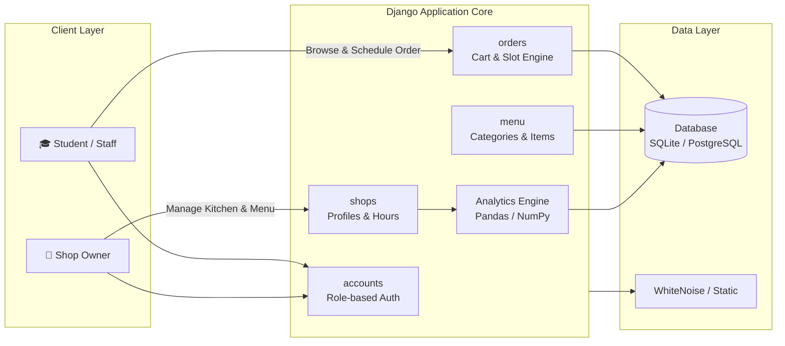

<div align="center">

# 🛒 foodR
### Next-Gen Campus Food Pre-Ordering & Crowd Management Platform

*Eliminate cafeteria rush hours, optimize kitchen throughput, and empower campus vendors with real-time analytics.*

<br/>

[](https://www.djangoproject.com/)
[](https://www.python.org/)
[](https://tailwindcss.com/)
[](https://developer.mozilla.org/en-US/docs/Web/JavaScript)
[](https://food-r-rouge.vercel.app/)
[](LICENSE)

<br/>

[🌐 **Live Demo**](https://food-r-rouge.vercel.app/) • [📖 **Developer Guide**](DEVELOPER_GUIDE.md) • [🛠️ **Admin Setup**](ADMIN_SETUP_GUIDE.md) • [🎨 **Theme Specs**](THEME_DOCUMENTATION.md) • [📋 **SRS Document**](docs/SRS.md)

</div>

---

## 📌 Table of Contents

- [Overview](#-overview)
- [Key Features](#-key-features)
- [System Architecture](#-system-architecture)
- [Tech Stack](#-tech-stack)
- [Project Structure](#-project-structure)
- [Getting Started](#-getting-started)
  - [Prerequisites](#prerequisites)
  - [Installation](#installation)
  - [Environment Configuration](#environment-configuration)
- [User Workflows](#-user-workflows)
- [Theme & Design System](#-theme--design-system)
- [Documentation Hub](#-documentation-hub)
- [Contributing](#-contributing)
- [License](#-license)

---

## 🌟 Overview

**foodR** is an end-to-end digital cafeteria ecosystem engineered to bridge college communities and on-campus food vendors. By enabling scheduled time-slot ordering, dynamic crowd throttling, and vendor-side order dispatching, foodR transforms chaotic lunch breaks into frictionless, zero-queue pickup experiences.

Built with **Django 5**, the platform offers role-specific interfaces for students, staff, shop owners, and system administrators, packed with real-time updates and an adaptive light/dark glassmorphic UI.

---

## ✨ Key Features

### 🎓 For College Students & Staff
- **⚡ Pre-Order & Time-Slot Scheduling**: Select specific pickup windows (e.g., 15-minute intervals) to ensure meals are ready precisely upon arrival.
- **🛒 Dynamic Session Cart**: Fast, interactive cart management with automatic subtotal calculations and custom instructions.
- **🔔 Live Order Status Tracking**: Real-time progress monitoring through 4 order states (`Placed` ➔ `Preparing` ➔ `Ready` ➔ `Completed`).
- **🌓 Adaptive Theme**: Instant toggle between Dark Mode and Light Mode with system preference detection and localStorage persistence.

### 🏪 For Campus Shop Owners & Vendors
- **📊 Real-Time Analytics**: Built-in Pandas & NumPy analytics tracking daily revenue, top-selling items, order volume, and peak ordering hours.
- **📋 Live Kitchen Queue Management**: Accept, process, advance, and mark orders complete with single-click operational controls.
- **🍽️ Full Menu Lifecycle Control**: Manage categories, toggle real-time item availability (in-stock/sold-out), update prices, and specify prep times.
- **⏱️ Capacity Throttling**: Configure maximum allowable orders per time slot to prevent kitchen overload during peak periods.

### 🛡️ Administrative & Platform Controls
- **👥 Role-Based Authentication**: Distinct permission pipelines for `college_user` and `shop_owner` profiles.
- **🔒 Enterprise Security**: Django CSRF protection, secure password hashing, and role-enforced view decorators.
- **⚡ Production Optimization**: WhiteNoise static file compression and serverless WSGI integration for fast cold starts.

---

## 🏗️ System Architecture



### Modular Django Apps

| App | Purpose & Core Responsibility |
| :--- | :--- |
| [`accounts/`](accounts/) | Custom profile management, role verification (`college_user` vs `shop_owner`), authentication views |
| [`shops/`](shops/) | Shop metadata, operating hours, slot limits, vendor dashboard, and analytics aggregation |
| [`menu/`](menu/) | Category hierarchies, menu item models, stock availability toggles, and pricing |
| [`orders/`](orders/) | Session-based cart, order placement, pickup slot validation, order lifecycle transitions |
| [`payments/`](payments/) | Payment records, transaction logging, and checkout linking |
| [`api/`](api/) | Serverless WSGI handler configured for Vercel deployment |

---

## 🛠️ Tech Stack

<div align="left">

| Layer | Technologies & Tools |
| :--- | :--- |
| **Backend** |    |
| **Frontend** |     |
| **Analytics** |   |
| **Database** |  *(Local)* /  *(Production)* |
| **Static / Media** |   |
| **Deployment** |  |

</div>

---

## 📁 Project Structure

```text
foodR/
├── accounts/               # User authentication & role profiles
├── api/                    # Serverless WSGI entrypoint for Vercel
├── docs/                   # Specifications & SRS documentation
│   └── SRS.md
├── foodR/                  # Core project configuration (settings, URLs, WSGI)
│   ├── settings.py
│   ├── urls.py
│   └── wsgi.py
├── menu/                   # Menu categories, items, and inventory logic
├── orders/                 # Cart logic, pickup slot scheduler, and order queue
├── payments/               # Payment logging & transaction state
├── shops/                  # Shop profiles, vendor dashboard, & analytics
├── static/                 # Static assets (Modern CSS tokens, JS theme toggle)
│   ├── css/modern-theme.css
│   └── js/theme-toggle.js
├── templates/              # Django HTML templates (Light/Dark Glassmorphism)
│   ├── accounts/
│   ├── menu/
│   ├── orders/
│   └── shops/
├── ADMIN_SETUP_GUIDE.md    # Guide for seeding test data and configuring shops
├── CODE_EXPLANATION.md     # In-depth architectural & codebase breakdown
├── DEVELOPER_GUIDE.md      # Detailed developer documentation
├── PROJECT_REVIEW.md       # Quality audit, fixes, & verification log
├── THEME_DOCUMENTATION.md  # CSS custom properties & component system
├── manage.py               # Django CLI management script
├── requirements.txt        # Python package dependencies
└── vercel.json             # Vercel deployment routing configuration
```

---

## ⚡ Getting Started

### Prerequisites
- **Python 3.10+** installed on your system.
- **Git** installed and configured.

### Installation

1. **Clone the repository:**
   ```bash
   git clone https://github.com/yogita-0204/foodR.git
   cd foodR
   ```

2. **Create and activate a virtual environment:**
   ```bash
   # Windows
   python -m venv venv
   venv\Scripts\activate

   # macOS / Linux
   python3 -m venv venv
   source venv/bin/activate
   ```

3. **Install dependencies:**
   ```bash
   pip install -r requirements.txt
   ```

4. **Apply database migrations:**
   ```bash
   python manage.py migrate
   ```

5. **Create a superuser / admin account:**
   ```bash
   python manage.py createsuperuser
   ```

6. **Start the local development server:**
   ```bash
   python manage.py runserver
   ```

7. **Access the application:**
   - 🌐 **Web App**: [http://127.0.0.1:8000/](http://127.0.0.1:8000/)
   - 🔒 **Django Admin**: [http://127.0.0.1:8000/admin/](http://127.0.0.1:8000/admin/)

---

## 🔐 Environment Configuration

Create a `.env` file in the root directory for production deployments:

| Variable | Required | Default | Description |
| :--- | :---: | :--- | :--- |
| `DJANGO_SECRET_KEY` | Yes | `dev-secret-key` | Secret key for cryptographic signing |
| `DJANGO_DEBUG` | No | `1` (`True`) | Toggle debug mode (`0` for production) |
| `DJANGO_ALLOWED_HOSTS` | No | `localhost,127.0.0.1` | Comma-separated list of allowed hostnames |
| `VERCEL_URL` | Auto | *(Auto-detected)* | Automatically configured on Vercel deployments |

---

## 🔄 User Workflows

```text
[Student / Staff Journey]
Register / Login ➔ Browse Shops ➔ Select Items ➔ Customize Cart ➔ Pick Time Slot ➔ Checkout ➔ Track Order Status ➔ Pickup

[Shop Owner Journey]
Login ➔ Vendor Dashboard ➔ View Incoming Orders ➔ Update Status (Preparing ➔ Ready) ➔ Manage Menu & Slots ➔ View Daily Analytics
```

---

## 🎨 Theme & Design System

foodR features a modern theme engine driven by CSS Custom Properties and Glassmorphism effects:

- 🌓 **Instant Theme Toggle**: Toggle between Light and Dark mode seamlessly.
- 💎 **Modern Glass Cards**: Frosted backdrop-filter panels with subtle border glows.
- 📱 **Mobile-First Layout**: Fully responsive tables, cards, and navigation drawer.

For detailed token documentation and reusable UI components, see [THEME_DOCUMENTATION.md](THEME_DOCUMENTATION.md).

---

## 📚 Documentation Hub

| Document | Purpose |
| :--- | :--- |
| 📖 [**Developer Guide**](DEVELOPER_GUIDE.md) | Deep technical architecture, model diagrams, API specifications, and code guides. |
| 🛠️ [**Admin Setup Guide**](ADMIN_SETUP_GUIDE.md) | Step-by-step instructions to create sample shops, menus, categories, and test accounts. |
| 🎨 [**Theme Documentation**](THEME_DOCUMENTATION.md) | CSS design system, color tokens, dark mode guidelines, and custom class references. |
| 🔍 [**Project Review & Audit**](PROJECT_REVIEW.md) | Quality assurance log, recent bug fixes, and system verification results. |
| 📋 [**SRS Document**](docs/SRS.md) | Software Requirements Specification covering functional and non-functional requirements. |

---

## 🤝 Contributing

Contributions make the open-source community an incredible place to learn, inspire, and create:

1. **Fork** the Project
2. Create your Feature Branch (`git checkout -b feature/AmazingFeature`)
3. Commit your Changes (`git commit -m 'Add some AmazingFeature'`)
4. Push to the Branch (`git push origin feature/AmazingFeature`)
5. Open a **Pull Request**

---

## 📄 License

Distributed under the **MIT License**. See `LICENSE` for more information.

<br/>

<div align="center">
  <sub>Built with ❤️ for campus communities. Powered by Django & Python.</sub>
</div>
