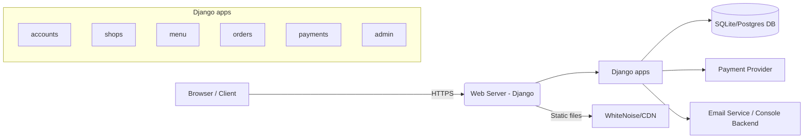
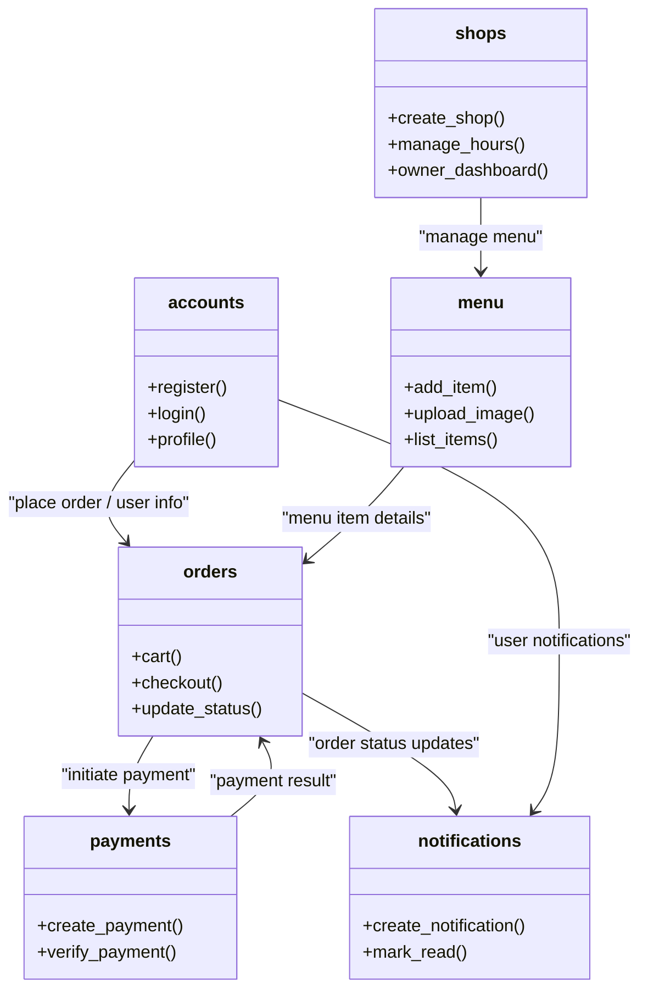
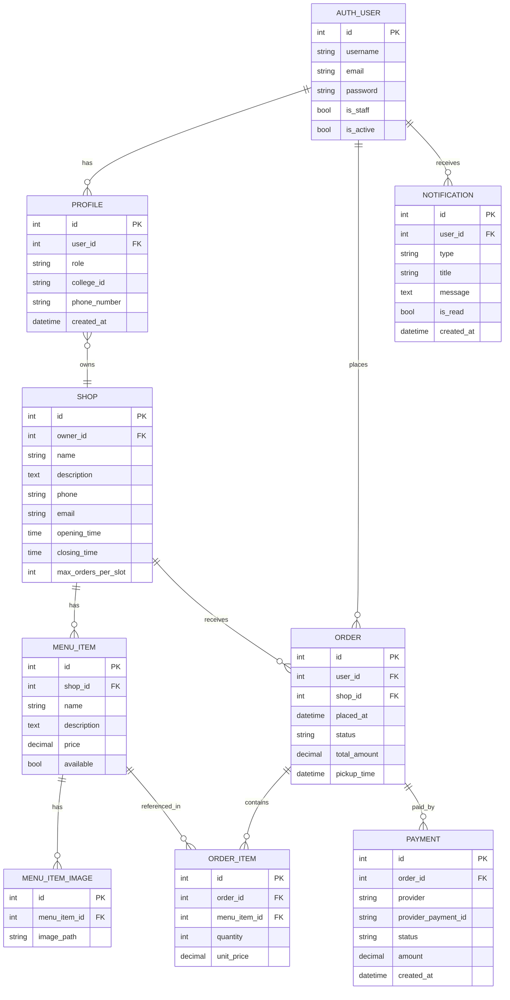

# Software Requirements Specification (SRS)

Project: ShopApp / foodR
Author: Generated
Date: 2026-05-08

## 1. Introduction

- Purpose: This SRS describes functional and non-functional requirements for the ShopApp (foodR) project: a Django-based platform for college users to order food from nearby shop owners, and for shop owners to manage menus and orders.
- Scope: Web application with user accounts, shop owner accounts, menu management, ordering, payments integration, notifications, and an admin panel.

## 2. Overall Description

- Users: College users (students/staff) and Shop owners.
- Major features:
  - Registration and login for both user types
  - Role-based dashboard and access control
  - Shop and menu management for owners
  - Browsing and ordering menu items for users
  - Order lifecycle management (placed → preparing → ready → completed/cancelled)
  - Payments integration (payments app)
  - Notifications for order status and admin events
  - Admin panel for managing models and site content

## 3. Functional Requirements

1. FR1 — User registration and authentication
   - Users may register as college users or shop owners.
   - Users authenticate via email (username=email).
2. FR2 — Role-based access
   - `Profile.role` distinguishes `college_user` and `shop_owner`.
   - Shop-owner-only views require the `shop_owner` role.
3. FR3 — Shop management
   - Shop owners create and configure their shops, menus, hours, and capacity.
4. FR4 — Menu & items
   - Menu items have images, price, description, and category.
5. FR5 — Ordering
   - Users add items to cart, checkout, and place orders with pickup time selection.
   - Orders produce notifications and update order status.
6. FR6 — Payments
   - Payment records are stored and linked to orders.
7. FR7 — Notifications
   - Notifications are stored in `Notification` and surfaced in the UI.
8. FR8 — Admin panel
   - Admin (Django admin) manages `Profile`, `Notification`, `Shop`, `MenuItem`, `Order`, and `Payment` models.

## 4. Non-functional Requirements

- NFR1 — Security: Use Django's authentication and CSRF protection; session cookie settings configured in `settings.py`.
- NFR2 — Performance: Support typical college load; caching static files via WhiteNoise in production.
- NFR3 — Maintainability: Modular Django apps (`accounts`, `shops`, `menu`, `orders`, `payments`).
- NFR4 — Portability: Runs on Python 3.13+ and Django 5.x.
- NFR5 — Data retention: Keep order and payment history; notifications expire by business rule.

## 5. System Architecture

High-level architecture (Mermaid):

Notes: The web server runs the Django application, which routes requests to app-level views. Persistent storage is a relational DB (sqlite for development; Postgres recommended for production). Payment provider is an external service.

## 6. Component / Low-level Diagram

Component interactions and responsibilities (Mermaid):

## 7. Database ER Diagram

ER diagram (Mermaid ER):

## 8. Data Dictionary (key fields)

- `AUTH_USER.username` — Email used as username.
- `PROFILE.role` — Enum: `college_user` or `shop_owner`.
- `SHOP.max_orders_per_slot` — Limit used in scheduling pickup windows.
- `MENU_ITEM.price` — Decimal currency value.
- `ORDER.status` — Enum: `placed`, `preparing`, `ready`, `completed`, `cancelled`.
- `PAYMENT.status` — Enum: `pending`, `success`, `failed`, `refunded`.

## 9. Use Cases (brief)

- UC1: Register & Login (User)
- UC2: Register Shop Owner & Create Shop
- UC3: Browse Shops & Menu
- UC4: Add to Cart & Checkout
- UC5: Shop Owner Accepts & Prepares Order
- UC6: User Picks up Order & Confirms Completion

## 10. Constraints & Assumptions

- Assumes external payment provider integration for real payments.
- Development uses SQLite; production should use Postgres or MySQL.
- Static files served by WhiteNoise in simple deployments; use CDN behind production.

## 11. Admin & Authorization Notes

- Django Admin (`/admin/`) is enabled and `accounts.admin` registers `Profile` and `Notification`.
- Admin access requires a superuser with `is_staff=True` and `is_superuser=True` as per Django.
- Role-based view access is enforced at view level by checking `Profile.role` or decorators.

## 12. Deployment Recommendations

- Use Postgres, configure `ALLOWED_HOSTS`, and set `DEBUG=False`.
- Configure real email backend and secure environment variables for `SECRET_KEY`.
- Use Gunicorn / Daphne behind Nginx for production; enable HTTPS and HSTS.

---

If you want, I can also:
- export the diagrams as PNG/SVG files,
- move `SRS.md` to a different folder, or
- generate PlantUML versions of the diagrams.
